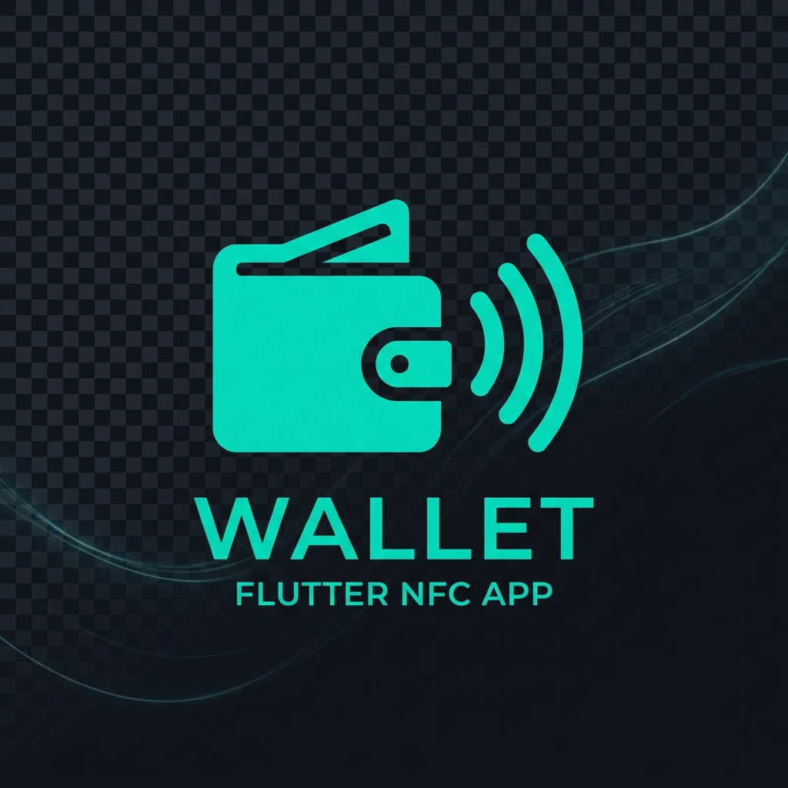

# 1. Présentation du Projet
La **VAULT Wallet Application** est une solution mobile innovante développée pour faciliter les transactions financières sécurisées via des protocoles sans contact. Ce projet a été réalisé dans le cadre de l'unité d'enseignement **ICT218**.

## Équipe de développement
Le projet a été réalisé par une équipe de **5 personnes**, avec une répartition des tâches basée sur une méthodologie Agile :
- **Gestion de projet & Documentation**
- **Architecture & Clean Architecture**
- **Interface Utilisateur (UI/UX)**
- **Intégration NFC & Connectivité (Bluetooth/Nearby)**
- **Base de données & Persistance**

## Calendrier de réalisation
Le développement s'est étalé sur une période intense de **3 semaines** :
- **Semaine 1 :** Analyse des besoins, conception de l'architecture et mise en place de l'environnement.
- **Semaine 2 :** Implémentation des services de transfert (NFC, Bluetooth, Nearby) et logique métier.
- **Semaine 3 :** Développement de l'UI (Système Solaire), résolution des contraintes techniques, implémentation de la biométrie, du système de facturation PDF, notifications, tests d'intégration automatisés, optimisation du pipeline CI et finalisation du rapport.

---

# 2. Stack Technologique
L'application repose sur un écosystème robuste et moderne :

| Domaine | Technologies |
| :--- | :--- |
| **Framework Mobile** | Flutter (Dart) |
| **Architecture** | Clean Architecture, Provider, GetIt |
| **Authentification** | Biométrie (Local Auth v3.0+) |
| **Persistance** | SQLite (sqflite) |
| **Connectivité** | NFC, Flutter Blue Plus, Nearby Connections |
| **Utilitaires** | PDF Generation, Notification, Share Plus |
| **Automatisation** | Integration Test Framework, GitHub Actions |
| **Outils de Build** | Gradle (Kotlin DSL), Pandoc |

---

# 3. Stratégie de Test
Pour garantir la fiabilité de l'application tout en respectant les limites des environnements CI/CD (GitHub Actions), nous avons adopté une double approche :
- **Mocking pour CI/CD :** Implémentation d'un `MockTransferService` permettant de tester l'UI et le flux de navigation sans nécessiter de matériel NFC/Bluetooth ni de multiples émulateurs simultanés.
- **Tests physiques :** La validation finale du protocole de transfert est effectuée sur des terminaux physiques réels pour garantir la compatibilité matérielle réelle.
- **Automatisation QA :** Utilisation du framework `integration_test` pour automatiser la capture d'écran des interfaces principales à chaque déploiement.

---

# 4. Contraintes Techniques & Défis rencontrés
Le développement a été ponctué de défis majeurs que l'équipe a dû surmonter dans un délai restreint :
- **Gestion du temps :** Réaliser l'ensemble des fonctionnalités en seulement 3 semaines a nécessité une organisation rigoureuse.
- **Disponibilité du matériel :** L'accès limité aux équipements physiques (plusieurs téléphones équipés de NFC/Bluetooth) a rendu les tests de connectivité complexes.
- **Erreurs de syntaxe YAML :** Résolution de clés en double dans `pubspec.yaml` lors de l'ajout itératif de dépendances.
- **Compilation :** Erreurs liées à des importations manquantes (`material.dart`) dues à une restructuration rapide du code.
- **Conflits de dépendances :** Résolution d'incompatibilités de versions (notamment `flutter_nfc_kit`) nécessitant une gestion fine du `pubspec.lock`.
- **Contraintes LaTeX :** Difficultés lors de la génération automatique de la documentation PDF (Pandoc) dues à l'incompatibilité des caractères spéciaux et des émojis.
- **Robustesse du scan :** Gestion des interférences en cas de proximité de plusieurs appareils (résolu par l'interface "Système Solaire").
- **Migration AGP :** Adaptation aux nouvelles exigences d'Android Gradle Plugin (9.0+) et migration vers le mécanisme de "Built-in Kotlin".
- **API Breaking Changes :** Mise à jour vers `local_auth` v3.0+ nécessitant une refonte de l'appel à l'API d'authentification biométrique (`authenticate` sans `AuthenticationOptions`).
- **Avertissements KGP & Dépréciations :** Certains plugins tiers (`nearby_connections`, etc.) utilisent encore des configurations Kotlin Gradle Plugin obsolètes qui génèrent des avertissements durant le build. Ces warnings sont hors de notre contrôle direct et nécessitent une mise à jour de la part des mainteneurs de ces bibliothèques. Nous maintenons la compatibilité maximale possible avec les versions actuelles.
- **Desugaring :** Résolution de l'erreur `checkReleaseAarMetadata` nécessitant l'activation du "core library desugaring" pour la compatibilité avec les API Java modernes.
- **Cache CI/CD :** Problèmes d'interfaces obsolètes dans les builds automatisés, résolus par l'ajout systématique de `flutter clean` avant chaque build.

---

# 5. Fonctionnalités Implémentées

### 5.1. Système de transfert & Connectivité
- **Multi-méthode :** NFC, Bluetooth et Quick Share (implémentation P2P fonctionnelle).
- **Interface Système Solaire :** Scan visuel intuitif permettant de sélectionner un destinataire unique parmi plusieurs appareils.
- **ServiceManager :** Gestion proactive de l'activation matérielle (Bluetooth/NFC).

### 5.2. Sécurité & User Experience
- **Biométrie :** Authentification sécurisée via empreinte digitale ou reconnaissance faciale (implémentation v3.0+).
- **Notifications :** Feedback temps réel pour toutes les transactions (recharges, envois, réceptions).
- **Facturation PDF :** Génération automatique de factures téléchargeables pour chaque transaction.
- **Automatisation QA :** Framework de tests d'intégration avec capture automatisée d'écrans dans le CI.

### 5.3. Interface Utilisateur (UI)
- **Hub Portefeuille :** Tableau de bord complet.
- **Paramètres :** Gestion granulaire des méthodes de transfert.
- **Historique :** Suivi détaillé des transactions.

---

# 6. Conclusion
Le projet **VAULT Wallet** est une réussite technique. En 3 semaines, l'équipe a su implémenter une solution complexe tout en respectant une architecture de qualité. Ce travail valide les acquis de l'UE ICT218 et démontre une maîtrise de l'écosystème Flutter et des interactions matérielles. L'application est aujourd'hui fonctionnelle, sécurisée, documentée et prête pour une utilisation avancée.
